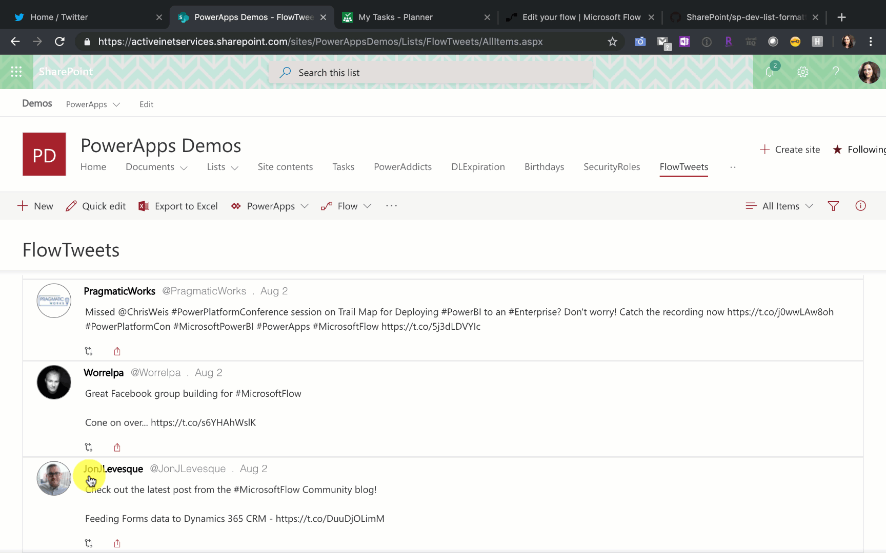

# Twitter Format

## Summary
This sample formats your SharePoint list view to look like Twitter.  If you are using the Microsoft Flow Templates to track tweets in a SharePoint list, this is a great way to format your list so that it looks more like Twitter.  For more info on Flow Templates that take Tweets and add them to a SharePoint list check out this template: https://us.flow.microsoft.com/en-us/galleries/public/templates/e78571e5c70e4806a18eeacba5a897c8/save-tweets-that-include-a-specific-hashtag-to-a-sharepoint-list/

This sample features the following:
- Responsive layout through flexbox
- Shows the number of retweets
- Share icon which takes you to the Tweet in Twitter so you can like, retweet, etc
- The Person's name is a hyperlink to their Profile
- Pulls in their Twitter Profile Picture

Screen Capture of how the links work:

## View requirements

|Type|Internal Name|Required|
|---|---|:---:|
|Single line of text|Title|Yes|
|Single line of text|TweetBy|Yes|
|Single line of text|TweetByFullName|Yes|
|Date Time|TweetDate|Yes|
|Calculated Column|TweetFormattedDate|Yes|
|Hyperlink|TwitterProfilePic|Yes|
|Hyperlink|LinkToTweet|Yes|
|Multi Line of Text|FullTweet|Yes|
|Number|NumbRetweets|Yes|

You need the TweetFormattedDate Calculated Column so that it only shows the current month name spelled out and date, not the year or time. The formula for this calculated column is below:

=TEXT(TweetDate,"mmm d")

## Sample

Solution|Author(s)
--------|---------
twitter-format | [April Dunnam](https://twitter.com/aprildunnam)

## Version history

Version|Date|Comments
-------|----|--------
1.0|August 2, 2019 |Initial release

## Disclaimer
**THIS CODE IS PROVIDED *AS IS* WITHOUT WARRANTY OF ANY KIND, EITHER EXPRESS OR IMPLIED, INCLUDING ANY IMPLIED WARRANTIES OF FITNESS FOR A PARTICULAR PURPOSE, MERCHANTABILITY, OR NON-INFRINGEMENT.**

---
